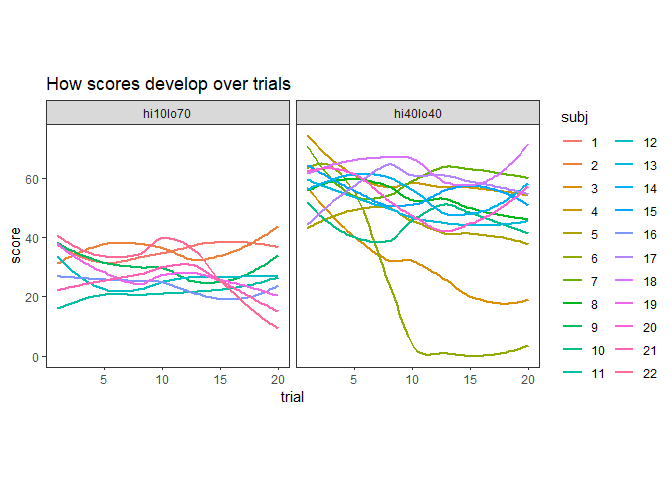
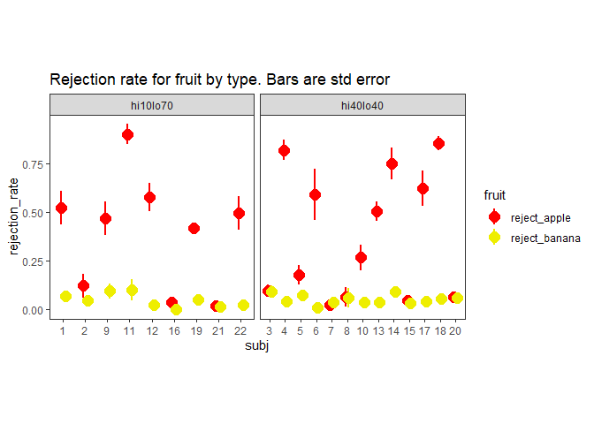

# Libraries


```r
if(!require(tidyverse)){install.packages("tidyverse")}
if(!require(ggpubr)){install.packages("ggpubr")} # for correlation geom, see  https://rpkgs.datanovia.com/ggpubr/reference/stat_cor.html
```

```
## Warning: package 'ggpubr' was built under R version 4.0.4
```

# function definition for the data consolidation function get()


```r
get <- function(){
  fls <- list.files(path='../data', pattern='*.csv', full.names=TRUE)
  dat = tibble()
  i=0
  for (fl in fls) {
    i=i+1
    cat(i, fl,'\n')
    f <- read_csv(fl, col_types = cols())
    f <- f %>% select(-contains(c("ethics","mouse","trials.")))
    f <- f %>% rename(pointer='please select your pointing device',conditionFullName=condition,condition=conditionProportion,trial=trialCount)
    f <- f %>% select(date,participant,OS,pointer,condition,phase,trial,current_time_list,frame_list,myevent_list,clicked_in_cells,points_list)#,points_per_second,n_low_consumed,n_hi_consumed,everything())
    f <- f %>% filter(!is.na(trial))
    dat <- bind_rows(dat,f) # dat is still a row-per-trial layout, you need to extract the lists to get row-per-frame layout
  }
  cat('finished reading csv files')
  dat <- dat %>% arrange(date,participant,trial)
  dat$pp <- factor(dat$date, levels=unique(dat$date), labels=1:length(unique(dat$date)))
  dat <- dat %>% rename(id=participant,participant=pp)
  dat <- dat %>% select(c(participant,id,date,OS,pointer,condition,phase,trial,current_time_list,frame_list,myevent_list,clicked_in_cells,points_list))
  dat <- dat %>% filter(phase=='experimental') %>% select(-phase)
  dat$OS=as_factor(dat$OS)
  dat$pointer=as_factor(dat$pointer)
  dat$condition=as_factor(dat$condition)
  
  dout=tibble()
  for(p in levels(dat$participant)) {
    for (t in unique(dat$trial)) {
      d = subset(dat,participant==p&trial==t)
      e = tibble(
        condition=d$condition,
        id=d$id,
        date=d$date,
        os=d$OS,
        pointer=d$pointer,
        subj=d$participant,
        trial=d$trial,
        frame=d$frame_list %>% str_sub(start=2,end=-2) %>% str_split(pattern=',') %>% unlist() %>% as.numeric(),
        time=d$current_time_list %>% str_sub(start=2,end=-2) %>% str_split(pattern=',') %>% unlist() %>% as_tibble_col() %>% pull() %>% as.numeric(),
        event=d$myevent_list %>% str_replace_all(c('\\['='','\"'='',']'='')) %>% str_split(pattern=',') %>% unlist() %>% as_tibble_col() %>% pull(),
        tree=d$clicked_in_cells %>% str_sub(start=2,end=-2) %>% str_split(pattern=',') %>% unlist() %>% as_tibble_col() %>% pull() %>% as.numeric(),
        row=ifelse(tree==-1,NA,floor(tree/24)),
        col=ifelse(tree==-1,NA,tree%%24),
        points=d$points_list %>% str_sub(start=2,end=-2) %>% str_split(pattern=',') %>% unlist() %>% as_tibble_col() %>% pull() %>% as.numeric(),
        points_inc = points>lag(points,default=FALSE)
      )
      # figure out ignored lo
      e <- e %>% mutate(visit_lo=ifelse((event=="sustained click in low value"),tree,NA))
      e <- e %>% mutate(eat_lo=ifelse((points_inc & event=="sustained click in low value"),tree,NA))
      visited_lo=as.numeric(na.omit(unique(e$visit_lo)))
      eaten_lo=as.numeric(na.omit(unique(e$eat_lo)))
      ignored_lo=setdiff(visited_lo,eaten_lo)
      e$reject_apple=length(ignored_lo)/length(visited_lo)
      e <- e %>% mutate(ign_lo=ifelse(tree %in% ignored_lo, tree,NA))
      # figure out ignored lo
      e <- e %>% mutate(visit_hi=ifelse((event=="sustained click in high value"),tree,NA))
      e <- e %>% mutate(eat_hi=ifelse((points_inc & event=="sustained click in high value"),tree,NA))
      visited_hi=as.numeric(na.omit(unique(e$visit_hi)))
      eaten_hi=as.numeric(na.omit(unique(e$eat_hi)))
      ignored_hi=setdiff(visited_hi,eaten_hi)
      e <- e %>% mutate(ign_hi=ifelse(tree %in% ignored_hi, tree,NA))
      e$reject_banana=length(ignored_hi)/length(visited_hi)

      dout=bind_rows(dout,e)
    }
  }
  return(list(dat,dout))
}
```

# do the get()


```r
d <- get()
```

```
## 1 ../data/16472_foraging-online-4_2021-03-02_20h59.34.063.csv 
## 2 ../data/16499_foraging-online-4_2021-03-06_01h24.04.524.csv 
## 3 ../data/16569_foraging-online-4_2021-03-09_10h15.39.227.csv 
## 4 ../data/17198_foraging-online-4_2021-03-06_17h09.09.864.csv 
## 5 ../data/17274_foraging-online-4_2021-03-07_09h58.18.208.csv 
## 6 ../data/17300_foraging-online-4_2021-03-06_20h51.11.049.csv 
## 7 ../data/17319_foraging-online-4_2021-03-04_09h48.17.515.csv 
## 8 ../data/17417_foraging-online-4_2021-03-07_15h01.55.258.csv 
## 9 ../data/17494_foraging-online-4_2021-03-06_18h16.15.777.csv 
## 10 ../data/17498_foraging-online-4_2021-03-02_20h46.04.334.csv 
## 11 ../data/17724_foraging-online-4_2021-03-07_13h49.58.934.csv 
## 12 ../data/17755_foraging-online-4_2021-03-06_19h59.50.943.csv 
## 13 ../data/17762_foraging-online-4_2021-03-04_08h28.23.029.csv 
## 14 ../data/17778_foraging-online-4_2021-03-04_00h15.21.602.csv 
## 15 ../data/17805_foraging-online-4_2021-03-07_10h22.37.466.csv 
## 16 ../data/17824_foraging-online-4_2021-03-06_17h59.44.364.csv 
## 17 ../data/17871_foraging-online-4_2021-03-03_10h52.24.362.csv 
## 18 ../data/17947_foraging-online-4_2021-03-03_15h22.27.283.csv 
## 19 ../data/17953_foraging-online-4_2021-03-02_22h34.09.830.csv 
## 20 ../data/17963_foraging-online-4_2021-03-05_18h17.05.508.csv 
## 21 ../data/18025_foraging-online-4_2021-03-03_13h05.40.316.csv 
## 22 ../data/18064_foraging-online-4_2021-03-04_13h06.48.253.csv 
## finished reading csv files
```

# turn the per-frame df into a per-event df (lossy)


```r
# turn the per-frame df into a per-event df (lossy)
e <- d[[2]]
e <- e %>% mutate(event=ifelse(points_inc&event=="sustained click in low value","consumed low value",event))
e <- e %>% mutate(event=ifelse(points_inc&event=="sustained click in high value","consumed high value",event))
e <- e %>% filter(event != 'null')
e <- e %>% filter(event != 'mouse newly released')
e <- e %>% filter(event != 'mouse newly down')
e <- e %>% filter(event != "attempt to click n drag detected and rejected")
e <- e %>% filter(event != "click in empty")
e <- e %>% filter(!(event==lead(event)&tree==lead(tree)&points==lead(points)&trial==lead(trial)))
e <- e %>% filter(!(event=="sustained click in low value"&lead(event)=="consumed low value"&tree==lead(tree)&trial==lead(trial)))
e <- e %>% filter(!(event=="sustained click in high value"&lead(event)=="consumed high value"&tree==lead(tree)&trial==lead(trial)))
e <- e %>% mutate(rejection_rate_difference = reject_apple - reject_banana)
e <- e %>% group_by(subj, trial) %>% 
  mutate(inter_click_interval=time-lag(time)) %>% ungroup()
```

# average over per-event data to get per-trial data (lossy)


```r
# average over per-event data to get per-trial data (lossy)
f <- e %>% 
  group_by(condition, id, os, date, pointer, subj, trial) %>% 
  summarise(score=max(points),
            ignl=length(na.omit(unique(ign_lo))),
            ignh=length(na.omit(unique(ign_hi))),
            visl=length(na.omit(unique(visit_lo))),
            vish=length(na.omit(unique(visit_hi))),
            eatl=length(na.omit(unique(eat_lo))),
            eath=length(na.omit(unique(eat_hi))),
            reject_apple=mean(reject_apple,na.rm=T),
            reject_banana=mean(reject_banana,na.rm=T),
            rejection_rate_difference=mean(rejection_rate_difference, na.rm=TRUE),
            inter_click_interval=mean(inter_click_interval,na.rm=TRUE)
            ) %>% 
  arrange(date) %>% 
  ungroup()
```

```
## `summarise()` has grouped output by 'condition', 'id', 'os', 'date', 'pointer', 'subj'. You can override using the `.groups` argument.
```

# average over trials to get subject means


```r
g <- f %>% 
  arrange(date) %>% 
  group_by(date,condition, id,os, pointer, subj) %>% 
  summarise(reject_apple=mean(reject_apple,na.rm=T),
            reject_banana=mean(reject_banana,na.rm=T),
            rejection_rate_difference=mean(rejection_rate_difference, na.rm=TRUE),
            inter_click_interval=mean(inter_click_interval, na.rm=TRUE),
            mean_score=mean(score, na.rm=TRUE)) %>% 
  mutate(subject_info=paste(subj,os,pointer)) %>% mutate(subject_info=as_factor(subject_info))
```

```
## `summarise()` has grouped output by 'date', 'condition', 'id', 'os', 'pointer'. You can override using the `.groups` argument.
```

# Points over trials


```r
ggplot(f,aes(y=score,x=trial,group=subj,color=subj)) +
  labs(title = 'How scores develop over trials') +
  geom_smooth(se=F) + 
  facet_wrap(~condition)+
  theme_bw()+theme(panel.grid.major=element_blank(), panel.grid.minor=element_blank(), aspect.ratio = 1)
```

```
## `geom_smooth()` using method = 'loess' and formula 'y ~ x'
```

<!-- -->

```r
ggsave('points_over_trials.png')
```

```
## Saving 7 x 5 in image
## `geom_smooth()` using method = 'loess' and formula 'y ~ x'
```

# Rejection rates for apples and bananas by subject


```r
flong <- f %>% pivot_longer(cols=c(reject_apple, reject_banana), names_to='fruit', values_to='rejection_rate')
ggplot(flong, aes(x=subj, y=rejection_rate, colour=fruit))+
  facet_wrap(~condition, scales='free_x')+
  scale_color_manual(values=c("red","yellow2"))+
  theme_bw()+theme(panel.grid.major=element_blank(), panel.grid.minor=element_blank(), aspect.ratio = 1)+
  ggtitle('Rejection rate for fruit by type. Bars are std error')+
  stat_summary(fun.data = 'mean_se', position=position_dodge(width=.4), size=1)
```

```
## Warning: Removed 29 rows containing non-finite values (stat_summary).
```

<!-- -->


<!-- # score as a function of inter-click-interval -->

<!-- ## regression for each condiiton -->

<!-- ```{r} -->
<!-- ggscatter(f, x='score', y='inter_click_interval', add='reg.line', conf.int=T, add.params = list(color = "condition", fill = "lightgray"), facet.by='condition') +  -->
<!--   stat_cor(method='pearson')+ -->
<!--   theme(aspect.ratio=1)+ -->
<!--   scale_color_manual(values=c("red","blue"))+ -->
<!--   ylab('inter-click interval')+ -->
<!--   ggtitle('inter-click interval by score') -->
<!-- ``` -->

<!-- ## Regression coefficient printed is per condition, regression line plotted for each subject -->

<!-- ```{r} -->
<!-- ggscatter(f, x='score', y='ici', add='reg.line', conf.int=T, add.params = list(color = "subj", fill = "lightgray"), facet.by='condition') +  -->
<!--   stat_cor(method='pearson')+ -->
<!--   theme(aspect.ratio=1)+ -->
<!--   ylab('inter-click interval')+ -->
<!--   ggtitle('Less time between clicks leads to higher scores\nLine per subject') -->
<!-- ``` -->

<!-- ## Regression coefficient and line per subject panel -->

<!-- ```{r, fig.width=10,fig.height=10} -->
<!-- ggscatter(f, x='score', y='ici', add='reg.line', conf.int=T, add.params = list(color = "condition", fill = "lightgray"), facet.by='subj') + stat_cor(method='pearson')+ -->
<!--   facet_wrap(~subj, scales='fixed')+ -->
<!--   scale_color_manual(values=c("red","blue"))+ -->
<!--   ylab('inter-click interval')+ -->
<!--   ggtitle('Inter-click interval against score') -->
<!-- ``` -->

<!-- ## Just the data with free scales to prioritise the relationship between x and y -->

<!-- ```{r, fig.width=10,fig.height=10} -->
<!-- ggscatter(f, x='score', y='ici', add='reg.line', conf.int=T, add.params = list(color = "condition", fill = "lightgray"), facet.by='subj') +  -->
<!--   # stat_cor(method='pearson')+ -->
<!--   facet_wrap(condition~subj, scales='free_y', labeller=labeller(.multi_line = FALSE))+ -->
<!--   scale_color_manual(values=c("red","blue"))+ -->
<!--   theme(aspect.ratio = .75, axis.text.y=element_blank(), axis.ticks.y=element_blank())+ -->
<!--   ylab('inter-click interval (different range for each panel)')+ -->
<!--   ggtitle('Less time between clicks leads to higher scores') -->
<!-- ``` -->


<!-- # Trial means violins -->

<!-- ```{r} -->
<!-- # plot trial means for rejection rate: # violins and points for each trial/fruit/subj -->
<!-- f2<-f %>% pivot_longer(cols=c(rej_lo,rej_hi),names_to='fruit',values_to='rejection_rate') %>%  -->
<!--   select(condition,subj,trial,fruit,rejection_rate) %>%  -->
<!--   mutate(fruit=ifelse(fruit=='rej_lo','apple','banana'),fruit=as_factor(fruit)) -->
<!-- ggplot(f2,aes(x=subj, y=rejection_rate))+facet_wrap(~condition,scales='free_x')+ -->
<!--   theme(panel.grid.major=element_blank(), panel.grid.minor=element_blank(), panel.border=element_rect(color='black',fill=NA), panel.background=element_rect(fill="white"), aspect.ratio=1)+ -->
<!--   geom_violin(aes(fill=fruit),position=position_dodge(width = .6))+ -->
<!--   geom_point(pch=21,aes(fill=fruit),position = position_jitterdodge(jitter.width = NULL,jitter.height = 0,dodge.width = .6,seed =.123))+ -->
<!--   labs(title = 'Rejection rates by fruit type. Points are individual trials.')  -->
<!-- ``` -->

<!-- # simple means, but elaborate subject ids -->

<!-- ```{r} -->
<!-- # simple means, elaborate subject ids -->
<!-- g2=g %>% pivot_longer(cols=c(reject_lo,reject_hi)) %>% mutate(name=factor(name,levels=c("reject_lo","reject_hi"),labels=c("apples","bananas"))) %>% rename(fruit=name) -->
<!-- ggplot(g2,aes(y=value,x=subject_info,colour=fruit,pch=fruit))+facet_wrap(~condition,scales='free_x')+ -->
<!--   theme_bw()+theme(panel.grid.major=element_blank(), panel.grid.minor=element_blank(), panel.border=element_rect(color='black',fill=NA), panel.background=element_rect(fill="white"), aspect.ratio=1,axis.text.x=element_text(angle=45,hjust = 1))+ -->
<!--   labs(title='Rejection rates (mean over trials per subject)')+ -->
<!--   geom_point(size=4)+ -->
<!--   scale_color_manual(values = c(2,7)) -->
<!-- ``` -->

<!-- # Rejection rate preferences by subject: each point is a trial boxplot -->

<!-- ```{r} -->
<!-- # Rejection rate preferences by subject: each point is a trial -->
<!-- mytitle="Strength of preference to reject apples." -->
<!-- mysubtitle="The DV is the extent to which they ignore apples more than they ignore bananas, calculated per-trial.\nThe DV is 0 if people reject apples and bananas equally; positive if people reject apples more than bananas;\nand negative if they reject bananas more than apples" -->
<!-- mycaption=NULL#"The DV is the extent to which they ignore apples more than they ignore bananas, calculated per-trial." -->
<!-- mytag=NULL#"The DV is the extent to which they ignore apples more than they ignore bananas, calculated per-trial." -->
<!-- ggplot(f,aes(x=subj,y=rejection_rate_difference))+labs(title=mytitle,subtitle=mysubtitle,caption=mycaption,tag=mytag)+facet_wrap(~condition,scales='free_x')+theme(panel.grid.major=element_blank(), panel.grid.minor=element_blank(), panel.border=element_rect(color='black',fill=NA), panel.background=element_rect(fill="white"), aspect.ratio=1)+ -->
<!--   geom_boxplot()+ -->
<!--   geom_point(position=position_jitter(width=.1,seed=.1))+ -->
<!--   geom_hline(yintercept = 0, alpha=0.3)  -->
<!-- ``` -->

<!-- # panel per subject, how pref to reject apples changes over trials -->

<!-- ```{r,fig.width=10,fig.height=10} -->
<!-- # panel per subject, how pref to reject apples changes over trials -->
<!-- mytitle='How the preference for rejecting apples vs bananas varies over trials' -->
<!-- mycaption='0 on the DV means they rejected equal numbers of apples and bananas on that trial.\nPositive values mean they rejected more apples than bananas on that trial' -->
<!-- ggplot(f,aes(x=trial,y=rejection_rate_difference))+labs(title=mytitle,caption=mycaption)+facet_wrap(~subj)+ -->
<!--   theme(panel.grid.major=element_blank(), panel.grid.minor=element_blank(), panel.border=element_rect(color='black',fill=NA), panel.background=element_rect(fill="white"), aspect.ratio=1)+ -->
<!--   geom_point(position=position_jitter(width=.1,seed=.1))+ -->
<!--   geom_smooth(se=F,aes(color=condition))+ -->
<!--   geom_hline(yintercept = 0, alpha=0.1) + -->
<!--   scale_color_manual(values=c('blue','red')) -->
<!-- ``` -->

<!-- # Rejection rate differences by trial: each point is a subject -->

<!-- ```{r} -->
<!-- # Rejection rate differences by trial: each point is a subject -->
<!-- ggplot(f,aes(x=trial,y=rejection_rate_difference,group=subj,color=subj))+geom_point()+facet_wrap(~condition)+geom_smooth(se=F)+labs(title='rej is positive when the rejection rate for apples exceeds the rejection rate for bananas on that trial')+theme(panel.grid.major=element_blank(), panel.grid.minor=element_blank(), panel.border=element_rect(color='black',fill=NA), panel.background=element_rect(fill="white"), aspect.ratio=1.5) -->
<!-- ``` -->


<!-- # who ignores apples? -->

<!-- ```{r} -->
<!-- # who ignores apples? -->
<!-- ggplot(f,aes(y=ignl,x=trial,group=subj, color=factor(id)))+geom_smooth(se=F) +labs(title = 'who ignores apples?')+facet_wrap(~condition,scales='free')+theme(panel.grid.major=element_blank(), panel.grid.minor=element_blank(), panel.border=element_rect(color='black',fill=NA), panel.background=element_rect(fill="white"), aspect.ratio=1) -->
<!-- ``` -->

<!-- # score by subject -->

<!-- ```{r,fig.width=10,fig.height=10} -->
<!-- # score by subject -->
<!-- ggplot(f,aes(y=score,x=trial))+geom_point()+facet_wrap(~subj)+geom_smooth(se=F,aes(color=condition))+scale_color_manual(values=c('blue','red'))+theme(panel.grid.major=element_blank(), panel.grid.minor=element_blank(), panel.border=element_rect(color='black',fill=NA), panel.background=element_rect(fill="white"), aspect.ratio=1)+labs(title='How score varies over trials') -->
<!-- ``` -->

<!-- # Correlations -->

<!-- ## Correlate score against preference to ignore apples -->

<!-- Every trial, without regard to subject, split by condition -->

<!-- ```{r, fig.width=5,fig.height=5} -->
<!-- f <- f %>% mutate(scaled_score=scale(score)) -->
<!-- require(ggpubr) -->
<!-- ggscatter(data=f, x="score", y="rejection_rate_difference", -->
<!--           add="reg.line", conf.int=TRUE, add.params = list(color = "condition", fill = "lightgray"), -->
<!--           facet.by=c("condition") -->
<!--           )+ -->
<!--   scale_color_manual(values=c("red","blue"))+ -->
<!--   theme(aspect.ratio = 1)+ -->
<!--   stat_cor(method='pearson',label.y=1.2)+ -->
<!--   labs(title='Every trial, without regard to subject,\nsplit by condition') -->
<!-- ``` -->

<!-- ## Every trial, per-subject -->

<!-- ```{r, fig.width=10,fig.height=10} -->
<!-- f <- f %>% mutate(scaled_score=scale(score)) -->
<!-- require(ggpubr) -->
<!-- ggscatter(data=f, x="scaled_score", y="rejection_rate_difference",  -->
<!--           add="reg.line", conf.int=TRUE, add.params = list(color = "condition", fill = "lightgray"), -->
<!--           facet.by=c("subj"),ylim=c(-1, 1.6) -->
<!--           )+ -->
<!--   scale_color_manual(values=c("red","blue"))+ -->
<!--   theme(aspect.ratio = 1)+ -->
<!--   stat_cor(method='pearson',label.y=1.5)+ -->
<!--   labs(title='Every trial, per-subject') -->
<!-- ``` -->

<!-- ## Correlate rejecting apples against score -->

<!-- ```{r} -->
<!-- f <- f %>% mutate(scaled_score=scale(score)) -->
<!-- require(ggpubr) -->
<!-- ggscatter(data=f, x="scaled_score", y="rej_lo",# color="subj", -->
<!--           add="reg.line", conf.int=TRUE, add.params = list(color = "condition", fill = "lightgray"), -->
<!--           facet.by=c("condition") -->
<!--           )+ -->
<!--   scale_color_manual(values=c("red","blue"))+ -->
<!--   theme(aspect.ratio=1)+ -->
<!--   scale_y_continuous(breaks=seq(0,1,.5))+ -->
<!--   stat_cor(method='pearson',label.y=1.1)+ -->
<!--   labs(title='Every trial, without regard to subject,\nsplit by condition') -->
<!-- ``` -->

<!-- ## Aggregated data: a row is a subject mean -->

<!-- ```{r} -->
<!-- fgp <- f %>%  -->
<!--   mutate(scaled_score=scale(score)) %>%  -->
<!--   group_by(condition,subj) %>%  -->
<!--   summarise(mean_score=mean(score, na.rm=TRUE), mean_rej_apples=mean(rej_lo,na.rm=TRUE)) %>%  -->
<!--   ungroup() -->
<!-- require(ggpubr) -->
<!-- ggscatter(data=fgp, x="mean_score", y="mean_rej_apples",# color="subj", -->
<!--           add="reg.line", conf.int=TRUE, add.params = list(color = "condition", fill = "lightgray"), -->
<!--           facet.by=c("condition") -->
<!--           )+ -->
<!--   scale_color_manual(values=c("red","blue"))+ -->
<!--   theme(aspect.ratio=1)+ -->
<!--   scale_y_continuous(breaks=seq(0,1,.5))+ -->
<!--   stat_cor(method='pearson',label.y=1.1)+ -->
<!--   labs(title='Subject means split by condition') -->
<!-- ``` -->

<!-- # plot one random selection from trials -->

<!-- ```{r} -->
<!-- # plot one random selection from trials -->
<!-- sample_subj=sample(levels(e$subj),1) -->
<!-- sample_trial=sample(1:20,1) -->
<!-- sample_data=subset(e,subj==sample_subj&trial==sample_trial) -->
<!-- ggplot(data=sample_data,aes(y=row,x=col))+ -->
<!--   xlim(1,24)+ylim(1,24)+ -->
<!--   geom_point(aes(shape=event),size=5,alpha=.5)+ -->
<!--   geom_path(aes(color=time))+ -->
<!--   theme(aspect.ratio = 1)+ -->
<!--   labs(title = paste('subj', sample_subj, 'trial', sample_trial))+ -->
<!--   theme(aspect.ratio=1, panel.grid.major=element_blank(), panel.grid.minor=element_blank(), panel.border=element_rect(color='black',fill=NA), panel.background = element_rect(fill = "white")) -->
<!-- ``` -->
