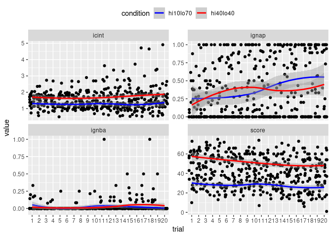
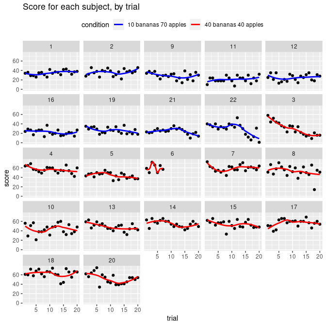
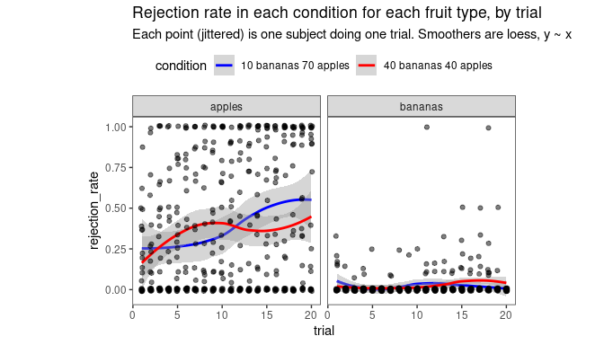
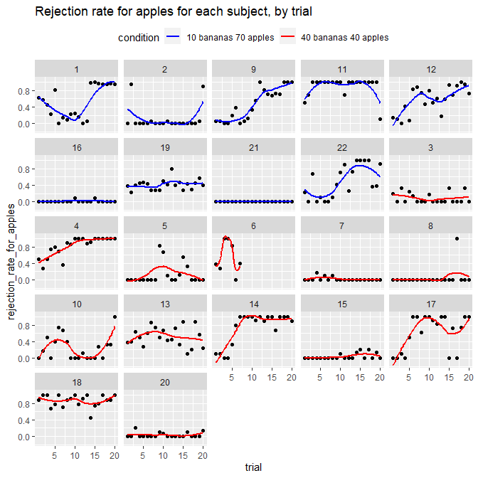
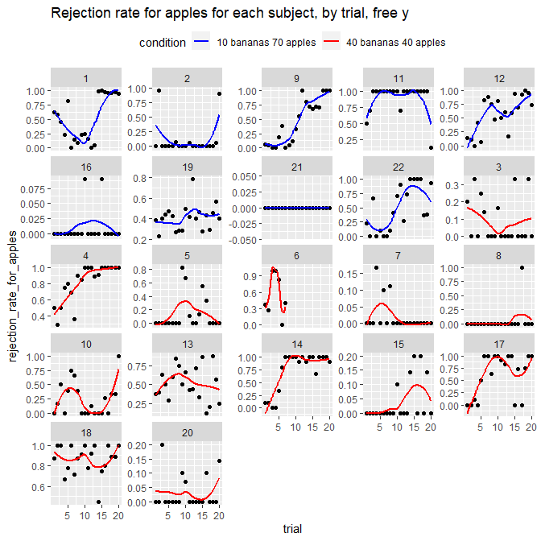
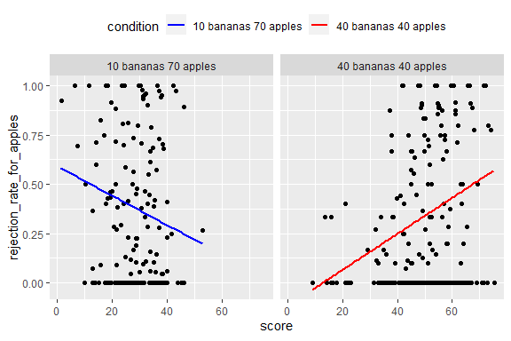

<style type="text/css">
.main-container {
  max-width: 1800px;
  margin-left: auto;
  margin-right: auto;
}
</style>


## Part 1 read in the data

From previously-generated csv files.


## Part 2 explore the data

Just plot all 4 metrics.

<!-- -->

How score varies

<!-- -->


Bananas are very rarely ignored. Apples are ignored more often, and they get ignored more as the trials progress.

<!-- -->

Rejection rate for apples for each subject, by trial

<!-- -->

Same but with free y axis

<!-- -->

Rejection rate against score

<!-- -->


<!-- In the rare bananas condition, ignoring apples is associated with lower scores. In the frequent bananas condition, ignoring apples is associated with higher scores. -->

<!-- ```{r, fig.width=7,fig.height=4} -->
<!-- d=read_csv("d3_trial_by_trial.csv") -->
<!-- ggplot(d, aes(y=ignap, x=score))+ -->
<!--   facet_wrap(~condition)+ -->
<!--   geom_jitter()+ -->
<!--   geom_smooth(aes(colour=condition),method='lm',formula='y~x')+theme(aspect.ratio =1) -->
<!-- ``` -->

<!-- Larger inter-click durations (slower moving around) is associated with lower scores. -->

<!-- ```{r, fig.width=7,fig.height=4} -->
<!-- d=read_csv("d3_trial_by_trial.csv") -->
<!-- ggplot(d, aes(x=score, y=icint))+ -->
<!--   facet_wrap(~condition)+ -->
<!--   geom_jitter()+ -->
<!--   geom_smooth(aes(colour=condition),method='lm',formula='y~x')+theme(aspect.ratio =1) -->
<!-- ``` -->

<!-- foo -->

<!-- ```{r, fig.width=7,fig.height=4} -->
<!-- d=read_csv("d3_trial_by_trial.csv") -->
<!-- ggplot(d, aes(x=ignap, y=ignba))+ -->
<!--   facet_wrap(~condition)+ -->
<!--   geom_jitter()+ -->
<!--   geom_smooth(aes(colour=condition),method='lm',formula='y~x')+theme(aspect.ratio =1) -->
<!-- ``` -->

