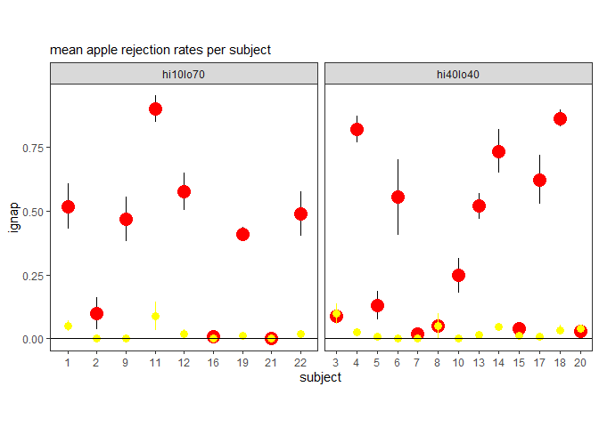
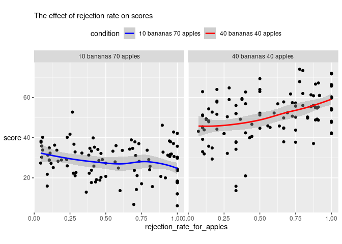
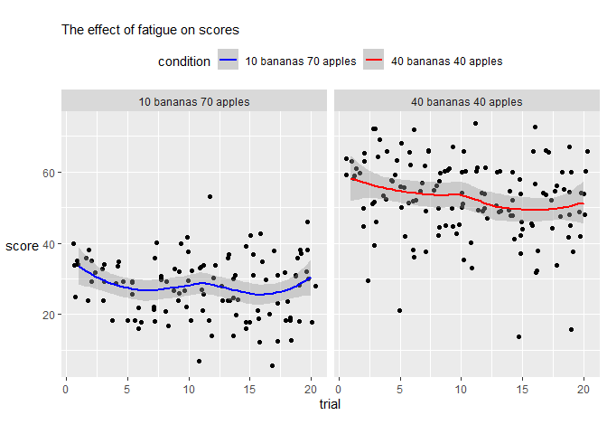
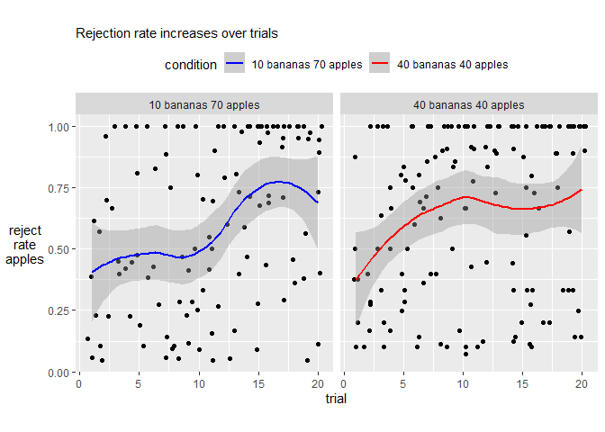
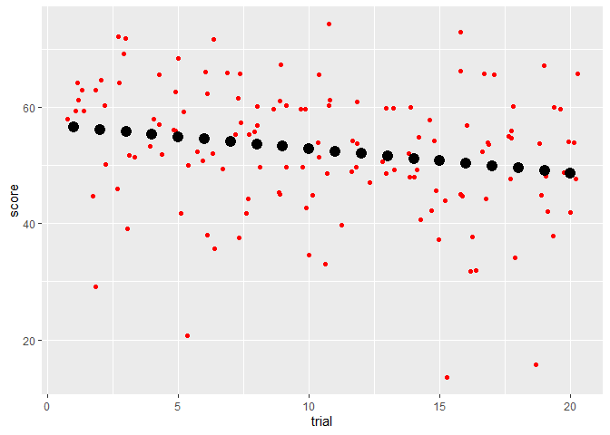
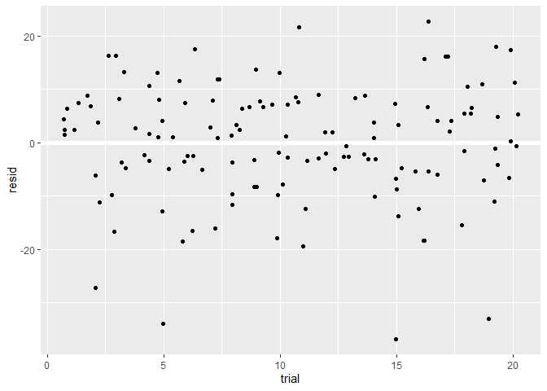
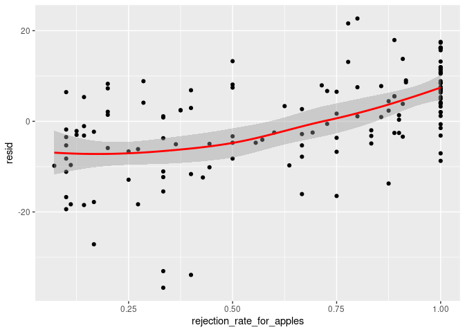
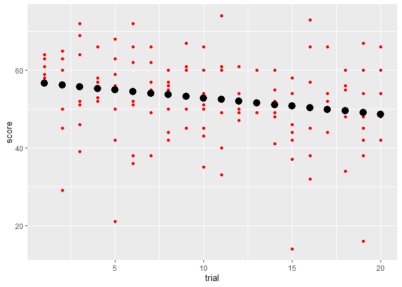
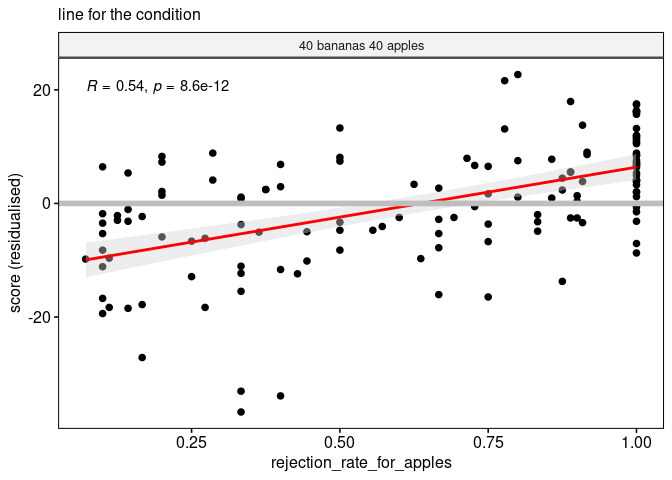
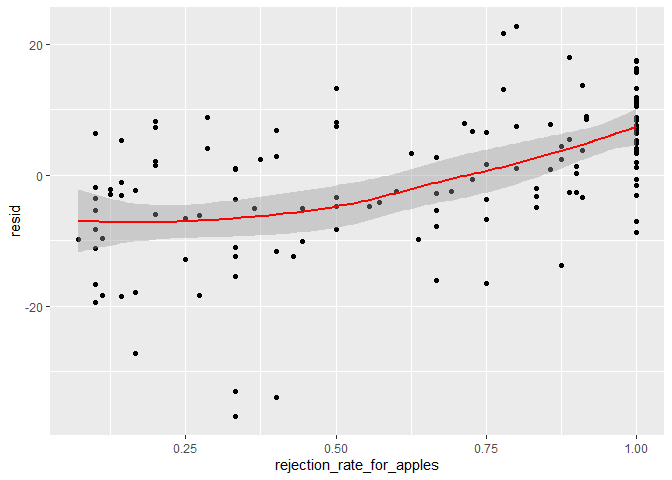

<style type="text/css">
.main-container {
  max-width: 1800px;
  margin-left: auto;
  margin-right: auto;
}
</style>


```
       trial
subject 1 2 3 4 5 6 7 8 9 10 11 12 13 14 15 16 17 18 19 20
     1  1 1 1 1 1 1 1 1 1  1  1  1  1  1  1  1  1  1  1  1
     2  1 1 1 1 1 1 1 1 1  1  1  1  1  1  1  1  1  1  1  1
     3  1 1 1 1 1 1 1 1 1  1  1  1  1  1  1  1  1  1  1  1
     4  1 1 1 1 1 1 1 1 1  1  1  1  1  1  1  1  1  1  1  1
     5  1 1 1 1 1 1 1 1 1  1  1  1  1  1  1  1  1  1  1  1
     6  1 1 1 1 1 1 1 0 0  0  0  0  0  0  0  0  0  0  0  0
     7  1 1 1 1 1 1 1 1 1  1  1  1  1  1  1  1  1  1  1  1
     8  1 1 1 1 1 1 1 1 1  1  1  1  1  1  1  1  1  1  1  1
     9  1 1 1 1 1 1 1 1 1  1  1  1  1  1  1  1  1  1  1  1
     10 1 1 1 1 1 1 1 1 1  1  1  1  1  1  1  1  1  1  1  1
     11 1 1 1 1 1 1 1 1 1  1  1  1  1  1  1  1  1  1  1  1
     12 1 1 1 1 1 1 1 1 1  1  1  1  1  1  1  1  1  1  1  1
     13 1 1 1 1 1 1 1 1 1  1  1  1  1  1  1  1  1  1  1  1
     14 1 1 1 1 1 1 1 1 1  1  1  1  1  1  1  1  1  1  1  1
     15 1 1 1 1 1 1 1 1 1  1  1  1  1  1  1  1  1  1  1  1
     16 1 1 1 1 1 1 1 1 1  1  1  1  1  1  1  1  1  1  1  1
     17 1 1 1 1 1 1 1 1 1  1  1  1  1  1  1  1  1  1  1  1
     18 1 1 1 1 1 1 1 1 1  1  1  1  1  1  1  1  1  1  1  1
     19 1 1 1 1 1 1 1 1 1  1  1  1  1  1  1  1  1  1  1  1
     20 1 1 1 1 1 1 1 1 1  1  1  1  1  1  1  1  1  1  1  1
     21 1 1 1 1 1 1 1 1 1  1  1  1  1  1  1  1  1  1  1  1
     22 1 1 1 1 1 1 1 1 1  1  1  1  1  1  1  1  1  1  1  1
```

A full design would have 22 * 20 = 440 rows. Actually there are 427 rows. All the (13) missing trials are from subject 6.

Mean rejection rates per subject



Look at the data before excluding anything.


Rejection rate of 0 means they ate every apple they came across and they came across at least one. Replace with NA because they are not doing the rejection behaviour at all (not just not doing it very much).


Remove 173 trials for not doing the rejection behaviour (NA rejection_rate_for_apples)


Remove 3 remaining NA rows for having NA banana rejection rate - meaning that they didn't encounter any bananas at all after a full minute of searching.


251 trials left out of 440. Show which subjects had which trials removed.


```
       trial
subject 1 2 3 4 5 6 7 8 9 10 11 12 13 14 15 16 17 18 19 20
     1  1 1 1 1 1 0 1 1 1  1  1  0  1  1  1  1  1  1  1  1
     2  0 1 0 0 0 0 1 0 0  0  1  0  0  0  0  0  0  0  1  1
     3  1 1 0 0 1 1 0 1 1  1  1  1  1  1  1  1  1  1  1  1
     4  0 1 1 1 1 1 1 1 1  1  1  1  1  1  1  1  1  1  1  1
     5  1 1 0 1 0 1 1 1 1  1  1  1  1  1  1  1  1  1  1  1
     6  0 0 0 0 0 0 0 0 0  1  0  0  0  0  1  0  0  0  0  0
     7  1 1 1 1 1 1 1 1 1  1  1  1  1  1  1  1  1  1  1  1
     9  1 0 1 0 1 0 0 1 1  1  1  1  1  1  1  1  1  1  1  0
     10 1 0 1 0 1 1 0 0 0  1  0  0  0  0  1  0  0  0  1  0
     11 1 1 1 1 1 1 1 1 1  1  1  1  1  1  1  1  1  1  1  1
     12 0 0 0 0 0 0 0 0 1  1  1  0  0  1  1  1  0  0  0  0
     13 1 1 1 1 1 0 1 0 0  0  0  0  0  0  0  0  0  0  0  0
     14 0 0 0 1 0 1 0 1 0  0  0  0  0  0  0  0  0  0  0  0
     15 0 0 0 0 0 0 0 0 0  0  0  0  0  0  0  0  1  0  0  0
     16 0 1 1 0 1 1 1 1 0  0  0  1  0  0  0  1  0  1  1  1
     17 1 1 1 1 1 1 1 1 1  1  1  1  1  1  1  1  1  1  1  1
     18 1 1 0 0 1 1 1 1 1  1  1  1  1  1  1  1  1  1  1  1
     19 0 0 0 0 0 0 0 0 0  1  0  0  0  1  1  0  1  0  1  0
     20 0 0 1 0 1 1 1 1 1  1  1  1  1  1  0  1  0  1  1  1
     21 1 1 1 1 1 1 1 1 1  1  1  1  1  1  1  1  1  1  1  1
     22 0 0 1 0 0 0 0 0 1  1  0  0  0  0  0  1  0  0  0  1
```

After pruning the data




<!-- Score gets worse over trials - the effect of fatigue -->

<!-- ```{r} -->
<!-- ggplot(tbt, aes(trial, score)) + -->
<!--   scale_color_manual(values=c("blue","red")) + -->
<!--   facet_wrap(~condition) + -->
<!--   geom_smooth(method='lm', aes(color=condition)) + -->
<!--   geom_point() -->
<!-- ``` -->

<!-- Rejection strategy increases scores in the frequent-high-value condition only -->

<!-- ```{r} -->
<!-- ggplot(tbt, aes(rejection_rate_for_apples, score)) + -->
<!--   scale_color_manual(values=c("blue","red")) + -->
<!--   facet_wrap(~condition) + -->
<!--   geom_smooth(aes(color=condition)) + -->
<!--   geom_point() -->

<!-- ``` -->


## First for the condition with 40 bananas and 40 apples, hi40lo40

We want to remove the effect of fatigue from the score.


```r
freqhi <- subset(tbt, condition=="40 bananas 40 apples") 
```

First build a model of the influence of trial fatigue.


```r
mod <- lm(score ~ trial, data = freqhi)
```

Now make a grid to generate predictions. 


```r
grid <- freqhi %>% 
  data_grid(trial) %>% 
  add_predictions(mod, "score")
```

Plot the predictions (in black) over the raw data (in red) in the left-hand plot. The model captures the effect of fatigue quite well. In the middle plot show the residual scores after the effect of fatigue is factored out (i.e., the deviation from the score expected given the fatigue accrued over trials). In the right-hand plot show how residualised score is affected by rejection strategy - i.e., how rejection rate affects the component of score that is unexplained by fatigue.



Plots show a significant positive correlation between higher rejection rates for apples and higher scores on the task, after the effect of fatigue lowering scores over trials is factored out. Left plot shows correlation lines for each subject separately. Middle plot shows correlation lines for each subject without the raw data. Right plot shows the correlation line for the condition. Zero on the y axis represents the score we would expect for that trial if we only took into account how many trials they had done.




<!-- In the rare bananas condition, ignoring apples is associated with lower scores. In the frequent bananas condition, ignoring apples is associated with higher scores. -->

<!-- ```{r, fig.width=7,fig.height=4} -->
<!-- d=read_csv("d3_trial_by_trial.csv") -->
<!-- ggplot(d, aes(y=ignap, x=score))+ -->
<!--   facet_wrap(~condition)+ -->
<!--   geom_jitter()+ -->
<!--   geom_smooth(aes(colour=condition),method='lm',formula='y~x')+theme(aspect.ratio =1) -->
<!-- ``` -->

<!-- Larger inter-click durations (slower moving around) is associated with lower scores. -->

<!-- ```{r, fig.width=7,fig.height=4} -->
<!-- d=read_csv("d3_trial_by_trial.csv") -->
<!-- ggplot(d, aes(x=score, y=icint))+ -->
<!--   facet_wrap(~condition)+ -->
<!--   geom_jitter()+ -->
<!--   geom_smooth(aes(colour=condition),method='lm',formula='y~x')+theme(aspect.ratio =1) -->
<!-- ``` -->

<!-- foo -->

<!-- ```{r, fig.width=7,fig.height=4} -->
<!-- d=read_csv("d3_trial_by_trial.csv") -->
<!-- ggplot(d, aes(x=ignap, y=ignba))+ -->
<!--   facet_wrap(~condition)+ -->
<!--   geom_jitter()+ -->
<!--   geom_smooth(aes(colour=condition),method='lm',formula='y~x')+theme(aspect.ratio =1) -->
<!-- ``` -->

